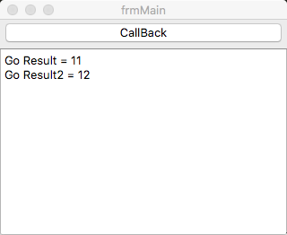

# lazarus_callback_go

Use pascal callback function to get Golang CGO function to Process in Lazarus.



## Purpose

Golang lacks powerful extension library support in the GUI and is more familiar with using Lazarus to complete the graphical interface.

## Thinking

Define a CallBackFunc function, which is referenced from the CGO compiled extension library and defined as follows:

```pascal
procedure CallBackFunc(_para1: longint; p0: intFunc); cdecl; external LIBGO_NAME;
```

Use the Pascal Callback method to call the Golang extension method for processing, for example:

```pascal
CallBackFunc(1, @FFCallbackForForm);
```

Where "1" is the incoming parameter, FFCallbackForForm is a callback function, and the function declaration is as follows:

```pascal
intFunc = procedure(_para1: longint); cdecl;
```

The parameter _para1 returned by the callback function is the result of Go processing, and then processed by Pascal output to the interface.

```pascal
procedure FFCallbackForForm(rev:longint); cdecl; // stdcall;
begin
  frmMain.Memo1.Lines.Add('Go Result = ' + inttostr(rev));
end;

Problem: Cannot declare the Callback function available to Lazarus dire
```

## Problems in the writingctly via Go
Solved: Using CGO, using C and Pascal bridging, then Go to process

Problem: Problems with cross-platform compilation
Solution: Ensure that Lazarus, Go, GCC are all the same architecture

## Project Test

Before testing, you need to ensure that Lazarus, Go, and GCC are installed correctly in the same architecture

### Clone project

Execute the command line `git clone https://github.com/GoLazarus/lazarus_callback_go.git`

### Compiled

`cd lazarus_callback_go && make`

### Use

Double-click on the executable file to see the result of Lazarus calling Go processing

## Discuss

Telegram:https://t.me/joinchat/IEdPshK9qaT4RmHn0zcQow

QQ Group:774507710

## Reference

- [Lazarus Cross compiling](http://wiki.lazarus.freepascal.org/Cross_compiling)

- [Golang cgo](https://github.com/golang/go/wiki/cgo)

- [Lazarus and Call back function](http://forum.lazarus.freepascal.org/index.php?topic=10571.0)


